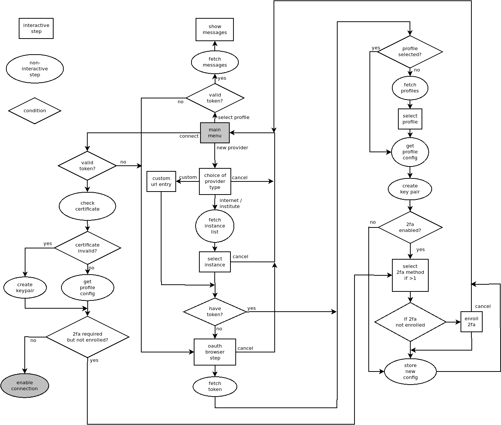

Developer notes
===============

Notes about code
----------------

Use the decorator ``eduvpn.utils.run_in_background_thread`` to schedule long running action
in the background to avoid blocking the main thread.

Never call GTK functions directly from a background thread,
use ``eduvpn.utils.run_in_main_gtk_thread`` to decorate functions
that must run on the main thread (eg. UI updates).

``eduvpn.actions`` are the entrypoints to the application and are triggered from the main menu or a VPN status
change.

``eduvpn.remote`` contains all remote requests.

Flow schema
-----------

Running the tests
-----------------

To run the automated tests,
use the following command from the root of the project.

.. code-block:: console

    $ pytest

To include integration tests against an actual server,
you'll need to provide the address and login credentials
in an environment variable.

.. code-block:: console

    $ TEST_SERVER=username:password@example.com pytest

How to make a release
---------------------

Prepare the code
^^^^^^^^^^^^^^^^

* Determine version number (for example 1.0.2)

* Compose a list of changes (check issue tracker)

* Make sure the test suite runs with python3

* Set version number in ``setup.py``, and ``eduvpn.spec``

* add changes to CHANGES.md

* Commit

* Press release button on github. List all changes here also

* Check if github actions builds.

Upload to pypi
^^^^^^^^^^^^^^

do a manual wheel upload using `twine <https://github.com/pypa/twine>`_:

.. code-block:: console

    $ rm dist/*
    $ python setup.py bdist_wheel sdist
    $ twine upload dist/*
    
Build on copr for RPMs
^^^^^^^^^^^^^^^^^^^^^^

Build packages to the `COPR repository <https://copr.fedorainfracloud.org/coprs/g/eduvpn/eduvpn-client/>`_:

  * on copr -> builds -> new build -> scm.
  * for clone URL field: https://github.com/eduvpn/python-eduvpn-client
  * Committish: the tag / version of the build
  * for spec file use: eduvpn.spec
  * Build for all supported/configured platforms

You can also trigger this build from the cli. First fetch your token from the `COPR api <https://copr.fedorainfracloud.org/api/>`_ page and dump this in `~/.config/copr`. Next, you install the copr cli and trigger the build with:

.. code-block:: console

   $ venv/bin/pip install copr-cli
   $ copr-cli buildscm \
      --clone-url https://github.com/edupvn/python-eduvpn-client \
      --commit <version> \
      --spec eduvpn.spec
      @eduvpn/eduvpn-client 

where `<version>` is the tag/version of the release.

Build Debian packages
^^^^^^^^^^^^^^^^^^^^^
   
* Update the debian package using the `eduVPN Debian meta files <https://github.com/eduvpn-debian/packaging>`_.
