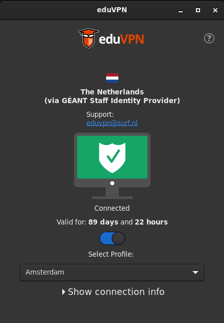

# About

This is the documentation about the eduVPN for Linux client.

This documentation provides an end-user installation, usage and troubleshooting guide.

Read more about the eduVPN project on the [eduVPN website](https://www.eduvpn.org/).

