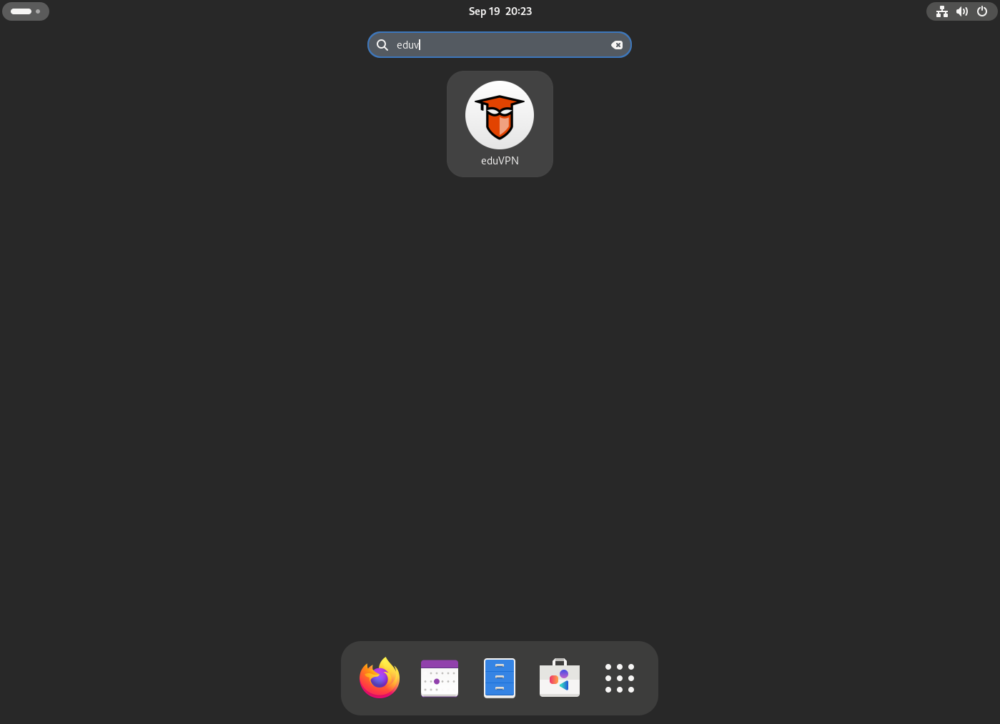

# Usage

## Graphical User Interface

If you have used a RPM or Deb package to install eduVPN, a desktop entry
is available:



If you installed the package by hand with for example pip, you can run
it manually:

``` bash
$ eduvpn-gui
```

## Command Line Interface

There is also a command line interface available for eduVPN since 2.0.
To see the available subcommands:

``` bash
$ eduvpn-cli --help
```

There is also an interactive mode that is aimed to be more user
friendly.

``` bash
$ eduvpn-cli interactive
```
