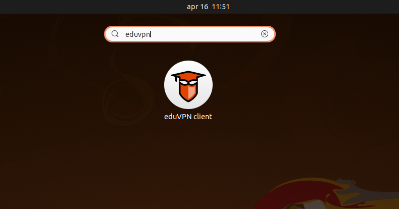

=====
Usage
=====

Graphical User Interface
========================

If you have used a RPM or DEB package to install eduVPN, a desktop entry is available:

If you installed the package by hand with for example pip, you can run it manually:

.. code-block:: bash

    $ eduvpn-gui

Command Line Interface
======================

There is also a command line interface available for eduVPN since 2.0. To see the available subcommands:

.. code-block:: bash

    $ eduvpn-cli --help

For example, to refresh your configured configuration and certicates one can run the refresh subcommand:

.. code-block:: bash

    $ eduvpn-cli refresh
    INFO:eduvpn.remote:Requesting https://demo.eduvpn.nl/info.json
    INFO:eduvpn.storage:updating token for https://demo.eduvpn.nl/
